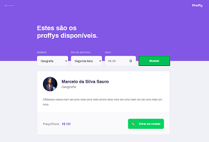
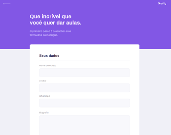

<p align="center">
  
</p>

<div align="center">


[](https://github.com/aimatama/Proffy/blob/master/LICENSE)<space> <space>

</div>

## 📑 Tabela de Conteúdos

- [Sobre](#-Sobre)
- [Screenshots](#-Screenshots)
- [Status do projeto](#-Status-do-projeto)
- [Tecnologias utilizadas](#-Tecnologias-utilizadas)
- [Como executar o projeto](#-Como-executar-o-projeto)
- [Licença](#-Licença)
- [Contato](#-Contato)

---

## 💬 Sobre

O projeto Proffy foi desenvolvido no evento **[Next Level Week #2](https://nextlevelweek.com/)** realizado em agosto de 2020.

## 🏁 Status do projeto

🏁 Finalizado!!! 🏆🏆🏆

---

## 🖥 Screenshots

<p align="center">
    
</p>
<p align="center">
    
</p>
<p align="center">
    
</p>
---

## 🚀 Tecnologias utilizadas

O projeto foi desenvolvido utilizando as seguintes tecnologias:

- [Typescript](https://www.typescriptlang.org/)
- [React](https://reactjs.org/)

---

## ▶️ Como executar o projeto

```
# Crie uma pasta para o projeto
> mkdir proffy

# Acesse a pasta do repositorio
> cd proffy

# Clone o repositório
git clone https://github.com/aimatama/Proffy.git

# Acesse a pasta do App Web
> cd web

# Instale as dependências do projeto
> yarn install

# Execute o projeto
> yarn start

```

Para acessar a aplicação abra o seu navegador WEB e acesse a URL `http://localhost:3000/`.

---

## 📜 Licença

O projeto está sob a licença [MIT](./LICENSE) ❤️

---

## ☎️ Contato

Para falar comigo:
<br/><br/>
[](https://www.linkedin.com/in/aimatama/)
[](mailto:aimatama@gmail.com)
<br/>
Gostou do projeto? Deixe uma estrelinha para ajudar!!! ⭐
